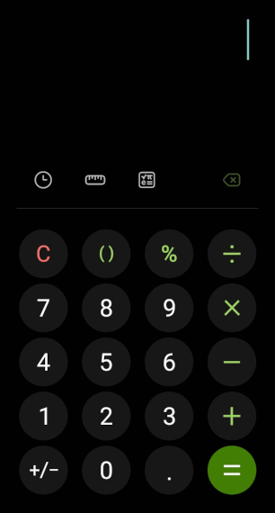

# Calculadora --- App para hacer operaciones matematicas con botones para los números y operadores matemáticos. La aplicación debe soportar numero de reales, de comoa flotante. Cuando un usuario ya haya puesto un punto al numero la aplicacion debera bloquear el boton del punto así como no permitir poner más de 1 punto por número, ya sean 2 punto juntos o alternados con digitos del mismo número. También debe calcalar las operaciones de manera automatica conforme el usuario vaya introduciendo los numeros y operadores. Debe de visualizarse el resultado con un color claro, es decir, sin que el usuario no haya presionado el botón de igual. Cuando se el botón de igual sea presionado el color del resultado de cambiar a un color mas oscuro, asi como  guardar tanto la operacion como el resultado en un historial. Debe ser capaz de realizar operacines con el valor del resulta previo obtenido si es que el
primero valor que sea digitado por el usuario es un operador, de lo contrario hara una
operacion normal.
La aplición debera tener 2 cajas para visualizar la operación y el otro el resultdo. Mientras 
no se haya presionado el botnn de resultado la operación se visualizara en una caja y el 
resultado en otra. Despues de preionado el igual el resultado se viaulozará en la caja donde
se visulizaba la operación. Si despues se oprime un número o punto se limpiara pantalla y se 
imprimir el nuevo numero. De lo contrario se usara el resultado como parte de la nueva operación

## Que se espera que la aplicción haga
   - Hacer operaciones automaticas y motrar el resultado conforme se vayan introduciendo 
   - los valores sin necesidad de presionar el boton igual.
   - Validar sin un valor numerico es valido, que no tenga mas de un punto.
   - visualizar tanto operación como resultado simultaneamente.
   - Despues de precionado el igual limpiar pantallaen ambas cajas de texto, despues 
     imprimir el resultado en la caja donde se visualizaba la operaciónn.
   - Guardar las operaciones y resultado como historial.
   - operar con el resultado previo si el primer valor es un operador.

## Variables
   - Variable operandoA, operandoB y resultado y  de tipo **Real** 
   - Variable historial para guadar el historial de de operaciones y resultado.
   - 1 variable para abstraerlo los botones de los números.
   - Variables controladoras para permitir o bloquear ciertas funciones.


## Datos disponibles
- Se requieren botones de 0 al nueve, los operadores de suma, resta, multiplicación y división,
  el botón del punto, un botón para el historial, un botón para borrar y uno para limpiar
  pantalla
- Un elemento para visualizar la operacion y uno para el resultado.
- El boton de igual debe de imprimir el resultado final.
  

## Pasos para crear la App 
- Hacer la estructura en html.
- Darles los estilos con css para que se vea como la calculadora de android.

- Crear los botones de los numeros del 0-9 y los operadores de suma, resta, multiplicacion, division, porcentaje, parentesis, borrrar, punto flotante, más_menos, limpiar pantalla e igual.

|      |
|---------------------------------------------------|
| <b>La imagen es solo representativa, una guía.</b> |

## Crear la apicacoin en JavaScript

```
Algoritmo Calculadora 
   
FinAlgoritmo
```


